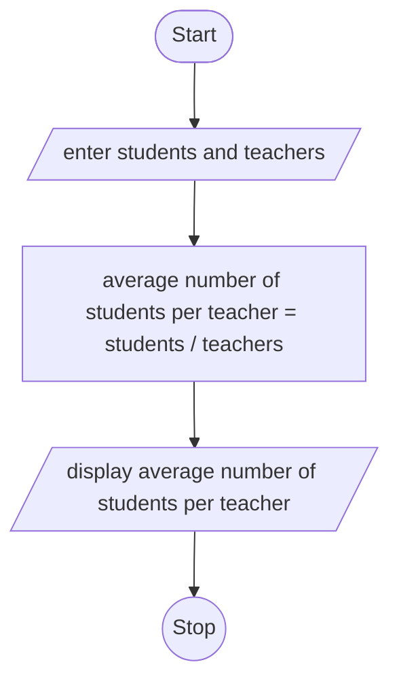

```mermaid
flowchart TD
    A(["Start"]) --> B[/enter students and teachers/]
    B --> C[average number of students per teacher = students / teachers]
    C --> D[/display average number of students per teacher/]
    D --> E((Stop))
```
